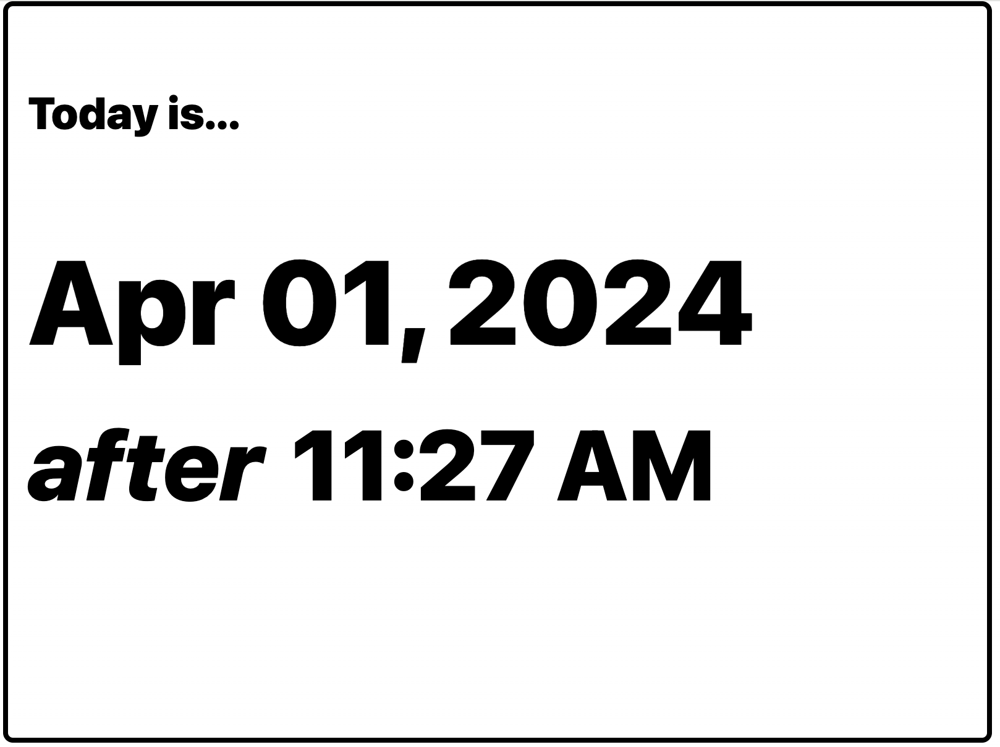

# kindle-cal

**kindle-cal** is a simple webapp using the [NextJS](https://nextjs.org/) framework, develped using [Typescript](https://www.typescriptlang.org/).

I'm repurposing an old Kindle Keyboard (3.4.3) to use as a dashboard
for slowly changing information, such as a calendar or low-fidelity clock.
The Kindle can display (4bit?) greyscale PNG images, but has very
little processing power. This app can be used to easily
generate a Dashboard and then render that dashboard as a
PNG that is appropriate for a Kindle.



On the Kindle side, I'm using a modified version of
https://github.com/kdorff/kindle-dash. I will be updating my
fork with my changes (notably remoing the `xh` binary that
was failing on my Kindle).

# Getting the code running

Install [node](https://nodejs.org/en/download) for your platform. I've tested with v20.11.1.

Fork the code, if you like.

Checkout the code. If you didn't fork my code, you can use

```bash
git checkout https://github.com/kdorff/kindle-cal.git
cd kindle-cal
```

**Configure your `.env.local` file**

```.env.local
TZ=US/Central
HA_URL=http://HA_IP:8123/api/states/input_number.kindle_keyboard_battery
HA_TOKEN=eyJhbGciOiJIU***WKMPk0GVGKqlFOMA
```

Setting `TZ` will define the timezone. If omitted, it will default to `US/Central`.

`HA_URL` and `HA_TOKEN`, if defined, will read battery state using the Home Assistant
REST API. In this, reading the state for the `input_number` helper named
`input_number.kindle_keyboard_battery`.

**To start the application**

```bash
npm install
npm run dev
```

Then visit

- http://localhost:3000 to view the current dashboard
- http://localhost:3000/png to view a rotated, greyscale PNG of the current dashboard

# Running with docker compose

In the same folder as my `docker-compose.yml` file, I do

```
git clone https://github.com/kdorff/kindle-cal.git
```

which checks the project out into the folder `./kindle-cal`.

Add a stanza to `docker-compose.yml`

```docker-compose.yml
  kindle-cal:
    build: ./kindle-cal/
    container_name: kindle-cal
    restart: unless-stopped
    ports:
      - 3400:3000
    environment:
      - TZ=US/Central
      - HA_URL=http://HA_IP:8123/api/states/input_number.kindle_keyboard_battery
      - HA_TOKEN=eyJhbGciOiJIU***WKMPk0GVGKqlFOMA
```

My `update-and-restart.sh` script, which also lives in the
same folder as `docker-compose.yml`, updates all my
**docker compose** containers and restarts each.

```update-and-restart.sh
#!/bin/sh

# Update local git repos
here=`pwd`
cd ${here}/kindle-cal && git pull
cd ${here}

# Pull, rebuild restart all
docker compose pull &&
   docker compose build &&
   docker compose down &&
   docker compose up -d
```

The application should then be running on
`http://dockerhost:3400` where **dockerhost** is the name or
ip address of the machine running docker.

# Revisions

If you have great ideas, feel free to make a PR with suggested changes.

The content of the dashboard is within [src/app/components/kindle-cal/kindle-cal.tsx](https://github.com/kdorff/kindle-cal/blob/master/src/app/components/kindle-cal/kindle-cal.tsx)
